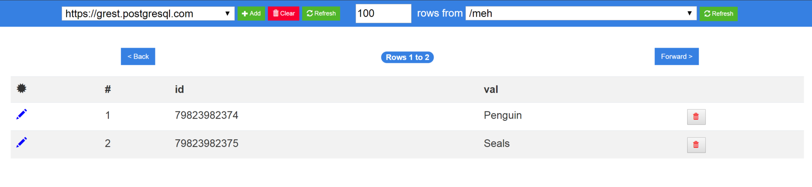

# Angular Postgrest
Try it on https://ng-postgrest.netlify.com/

The goal of this project is to build a simple Angular UI client (CRUD) for Postgrest (Postgrest is a REST wrapper for PostgresSQL. See https://postgrest.com). 

## Development

To install the node dependencies the project run `npm i` from within the root directory.

Run `npm start` for a dev server. Navigate to `http://localhost:4200/`. 

The app will automatically reload if you change any of the source files.

## Build

Run `npm run build` to build the project 

## Features

### Completed

  - Managing Postgrest endpoints
  - Table selection
  - Table pagination
  - Table pagination size
  - Table sorting
  - Update row (**currently testing for non-text fields**)
  - Delete row (with confirmation)

### Next to be implemented

  - Insert new row
  - Simple queries (AND only)

### Planned
please open an issue if you need a feature

### Stack

  - **Angular 8**
  - **Bootstrap 4**
  - **Sweet Alert 2**
  - **Karma**
  - Postgrest

